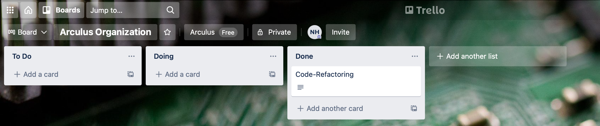
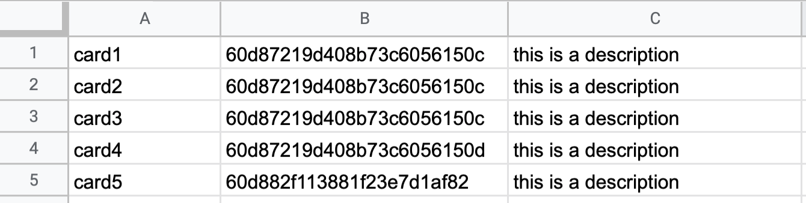

# arculus_trello_client
Client application to communicate with Arculus' Trello board.

This app is a client for Arculus organizational Kanban board.It allows the user to create new cards within the command line tool.

In order to do that a .json file should be configured with the parameters corresponding to the Arculus organizational borad. An example of this is provided in parameters_example.json.

## Running the application
To run the application, the user must start by executing the following command:

```console
foo@bar:~$ python3 Arculus_client.py
```

The user will be prompt to introduce cards manually or by a .csv file.

In case of choosing manual process the user must introduce the parameters following this format: card_name list_id description.
An example of this looks like this:
```console
Enter the desired option (manual/csv):manual
Enter the values for the desired Card separated by spaces (card_name list_id card_description) or path_to_csv\csv_name.csv
Code-Refactoring 60d87219d408b73c6056150d Code refactor was done correctly with the proper push to the repository
Card:  Code-Refactoring
Id of the List:  60d87219d408b73c6056150d
Descripton of the Card:  Code refactor was done correctly with the proper push to the repository
Card added successfully
```

After adding this card, our Kanban boards should look like the following image:



The user can also pick the option of adding Cards through csv file. To do that, every card will consist of a row in the csv file and each row is formed by card_name, list_id, description.
An example of this can be found in this repository as example.csv:



## Running from a docker container

With the code is also provided a dockerfile with everything that is needed to build a docker container and run the applicatino within it.
To do so, the user must build the image first:
```console
foo@bar:~$ docker build -t myimage .
```

The building takes a while but after it we are able to see the image like this:
```console
foo@bar:~$ docker images            
REPOSITORY   TAG       IMAGE ID       CREATED          SIZE
myimage      latest    cbd66809808f   27 seconds ago   943MB
```

In order to see the output in the console, before running the image, we should run the following:
```console
docker events&
```

Now we are ready to run the image:
docker run -i -t myimage
```console
2021-06-27T23:45:16.196296005+02:00 container create 98fb3fc9548d9bbb5dfe5c2521f79c7db06454c3b005e1e1c6100c778c6c3f9b (image=myimage, name=compassionate_elion)
2021-06-27T23:45:16.196296005+02:00 container create 98fb3fc9548d9bbb5dfe5c2521f79c7db06454c3b005e1e1c6100c778c6c3f9b (image=myimage, name=compassionate_elion)
2021-06-27T23:45:16.227672748+02:00 container attach 98fb3fc9548d9bbb5dfe5c2521f79c7db06454c3b005e1e1c6100c778c6c3f9b (image=myimage, name=compassionate_elion)
2021-06-27T23:45:16.227672748+02:00 container attach 98fb3fc9548d9bbb5dfe5c2521f79c7db06454c3b005e1e1c6100c778c6c3f9b (image=myimage, name=compassionate_elion)
token got from json file: acfa7dabac4a2513c44c02e370971774c73d4b3bfe2fbe8490ccd77e807b9ddf
board id got from json file 60d87219d408b73c6056150a
---------------------------------------------------------------------
Board Arculus Organization exists with the given id
The following Lists have been found within the mentioned Board:
 - Name: b'To Do', id: b'60d87219d408b73c6056150b'
 - Name: b'Doing', id: b'60d87219d408b73c6056150c'
 - Name: b'Done', id: b'60d87219d408b73c6056150d'
 - Name: b'Deprecated', id: b'60d8e234228c776c14f2da29'

2
Card added successfullyversion: 2.1

orbs:
  # The python orb contains a set of prepackaged CircleCI configuration you can use repeatedly in your configuration files
  # Orb commands and jobs help you with common scripting around a language/tool
  # so you dont have to copy and paste it everywhere.
  # See the orb documentation here: https://circleci.com/developer/orbs/orb/circleci/python
  python: circleci/python@1.2

workflows:
  sample:  # This is the name of the workflow, feel free to change it to better match your workflow.
    # Inside the workflow, you define the jobs you want to run. 
    # For more details on extending your workflow, see the configuration docs: https://circleci.com/docs/2.0/configuration-reference/#workflows 
    jobs:
      - build-and-test


jobs:
  build-and-test:  # This is the name of the job, feel free to change it to better match what you're trying to do!
    # These next lines defines a Docker executors: https://circleci.com/docs/2.0/executor-types/
    # You can specify an image from Dockerhub or use one of the convenience images from CircleCI's Developer Hub
    # A list of available CircleCI Docker convenience images are available here: https://circleci.com/developer/images/image/cimg/python
    # The executor is the environment in which the steps below will be executed - below will use a python 3.9 container
    # Change the version below to your required version of python
    docker:
      - image: cimg/python:3.8
    # Checkout the code as the first step. This is a dedicated CircleCI step.
    # The python orb's install-packages step will install the dependencies from a Pipfile via Pipenv by default.
    # Here we're making sure we use just use the system-wide pip. By default it uses the project root's requirements.txt.
    # Then run your tests!
    # CircleCI will report the results back to your VCS provider.
    steps:
      - checkout
      - run:
          name: check files
          command: | 
            ls
      - python/install-packages:
          pkg-manager: pip
          # app-dir: ~/project/package-directory/  # If you're requirements.txt isn't in the root directory.
          # pip-dependency-file: test-requirements.txt  # if you have a different name for your requirements file, maybe one that combines your runtime and test requirements.
      - run:
          name: Build Docker image
          command: docker build -t myimage .
Card added successfully
Card added successfully
Card added successfully
Card added successfully
2021-06-27T23:45:19.024258812+02:00 container die 98fb3fc9548d9bbb5dfe5c2521f79c7db06454c3b005e1e1c6100c778c6c3f9b (exitCode=0, image=myimage, name=compassionate_elion)
2021-06-27T23:45:19.024258812+02:00 container die 98fb3fc9548d9bbb5dfe5c2521f79c7db06454c3b005e1e1c6100c778c6c3f9b (exitCode=0, image=myimage, name=compassionate_elion)
2021-06-27T23:45:19.084162464+02:00 network disconnect 38004b887c4db93b7c73887bde5f9536314131cf103d99ad2b85ae9f287cec91 (container=98fb3fc9548d9bbb5dfe5c2521f79c7db06454c3b005e1e1c6100c778c6c3f9b, name=bridge, type=bridge)
2021-06-27T23:45:19.084162464+02:00 network disconnect 38004b887c4db93b7c73887bde5f9536314131cf103d99ad2b85ae9f287cec91 (container=98fb3fc9548d9bbb5dfe5c2521f79c7db06454c3b005e1e1c6100c778c6c3f9b, name=bridge, type=bridge)
```

The docker image app is set to add the cards that are specified in the example.csv file with no interaction of the user, this makes possible to have docker in an automated manner.


Finally the automated packaging has been done through CircleCI platform.